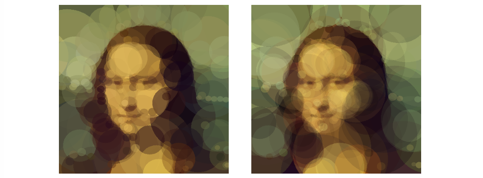

Image Compression with Evolutionary Algorithms
==============================================

The goal is to suggest an optimization algorithm based on genetic algorithms, which minimizes the difference of the pixel colors
of the prototype and the solution. The compressed images are represented as lists of basic geometric shapes - circles in this case.



Used Algorithms
---------------
**Steepest Ascent Hill Climber** As the first optimization attempt I used the Steepest Ascent Hill Climb algorithm, which for
this task worked really well. The reason is that the solution space contains many good local optima, which are very well found by
the hill-climbing algorithm. I used pool size 10 from which the best solution was selected in each iteration. Inspiration was
drawn from https://rogerjohansson.blog/2008/12/07/genetic-programming-evolution-of-mona-lisa/.

**Steady-State Evolutionary Algorithm** Each individual is replaced by its crossovered (with one another individual) and mutated
version only if it has strictly better fitness than the parent. This results in exchanging small parts of chromosomes between
individuals, but the diversity in the population is kept because a large part of a chromosome can never be duplicated in the population.

**Hybrid Evolutionary Algorithm** Because the hill climbing optimization works really well for this task I decided to combine hill
climbing epochs with the steady-state ones. The algorithm works in the following manner: For a given number of epochs I run the
steady-state evolutionary algorithm, which provides the evolutionary algorithm with crossover in between the individuals. Then,
the optimization switches to hill climbing and each individual is separately evolved for a given number of epochs. These two
types of optimization are interleaving for the whole evolution period.


Implementation - CPU vs. GPU
----------------------------
Fitness computation is expensive because the whole image (phenotype) has to be reconstructed from the list of shapes in order to
compute the pixel difference. Therefore a GPU (CUDA) version of the fitness computation process was programmed, which is about 10
to 30 times faster, depending on the population size. Details in [the GPU Report](reports/report_gpu.pdf).


Details
-------
  * [Report for GPU class (PDF)](reports/report_gpu.pdf)
  * [Report for Evolutionary Algorithms class (PDF)](reports/report_eoa.pdf)


Running the Code
----------------
To run the optimization choose one of the configuration files in the config folder and edit the `path_image`, `path_image_weights` and
`path_out` entries to correspond with your setup (the place you downloaded the code to). After that is done go to the bin folder and run on of the following commands:
```
./compress ../config/hill_climber_config.yaml              # CPU layered rendering
./compress_gpu ../config/hill_climber_config.yaml          # GPU layered rendering
./compress_average ../config/hill_climber_config.yaml      # CPU averaging rendering
./compress_average_gpu ../config/hill_climber_config.yaml  # GPU averaging rendering
```
Or with a different configuration file that you have chosen. The algorithm saves intermediate results every 200 epochs so soon
you should see images appearing in your path_out folder.


